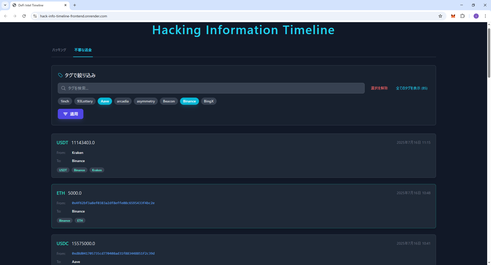

# DeFi Intel API Server

[](https://goreportcard.com/report/github.com/itout-datetoya/hack-info-timeline)

このプロジェクトは、SNSからDeFi関連のセキュリティ情報（ハッキング、資金移動）を収集・分析し、REST API経由で提供するGo言語のバックエンドサーバーです。

## デモ (Live Demo)


**[https://hack-info-timeline-frontend.onrender.com/](https://hack-info-timeline-frontend.onrender.com/)**

<div align="center">
  
</div>

## 主な機能

* **チャンネルからの定期的データ取得**: `gotd`ライブラリを使用し、ユーザーとしてチャンネルの投稿を定期的に取得します。
* **Gemini APIによるテキスト分析**: 取得した投稿内容をGoogleのGemini APIで分析し、構造化データ（プロトコル名、金額など）を抽出します。
* **REST API提供**: フィルタリングとカーソルベースのページネーション機能を備えたAPIエンドポイントを提供します。

## アーキテクチャ

このサービスは、以下のコンポーネントで構成されています。データの流れは、主に「定期的なデータ収集処理」と「ユーザーへのデータ表示処理」の2種類です。

```mermaid
    subgraph "バックエンド (Render)"
        C[Go API Server]
    end

    subgraph "外部サービス"
        D[SNS API]
        E[Gemini API]
    end

    subgraph "データベース (Render)"
        F[PostgreSQL]
    end

    %% 定期実行フロー
    C -- "1.投稿取得" --> D
    D -- "2.投稿テキスト" --> C
    C -- "3.分析リクエスト" --> E
    E -- "4.構造化データ" --> C
    C -- "5.DB保存" --> F
```


```mermaid
    subgraph "ユーザー"
        A[ブラウザ]
    end

    subgraph "フロントエンド (Render)"
        B[React App]
    end
    
    subgraph "バックエンド (Render)"
        C[Go API Server]
    end

    subgraph "データベース (Render)"
        F[PostgreSQL]
    end

    %% ユーザー操作フロー
    A -- "1.タイムライン表示" --> B
    B -- "2.APIリクエスト" --> C
    C -- "3.データ取得" --> F
    F -- "4.データ返却" --> C
    C -- "5.JSONレスポンス" --> B
    B -- "6.画面描画" --> A
```

## 技術スタック

* **言語**: Go (v1.23+)
* **データベース**: PostgreSQL
* **Webフレームワーク**: Gin
* **DBライブラリ**: sqlx
* **Telegramクライアント**: gotd
* **LLM**: Google AI Go SDK
* **DBマイグレーション**: golang-migrate/migrate
* **コンテナ化**: Docker


## 環境変数一覧

| 変数名                      | 説明                                                         | 例                                             |
| --------------------------- | ------------------------------------------------------------ | ---------------------------------------------- |
| `DATABASE_URL`                   | データベースのホスト名（Dockerの場合はコンテナ名）             | `postgresql://...`                |
| `GEMINI_API_KEY`            | Google AI (Gemini) のAPIキー                                 | `AIzaSy...`                                    |
| `TELEGRAM_APP_ID`           | TelegramのApp ID ([my.telegram.org](https://my.telegram.org)で取得) | `1234567`                                      |
| `TELEGRAM_APP_HASH`         | TelegramのApp Hash ([my.telegram.org](https://my.telegram.org)で取得) | `0123456789abcdef...`                          |
| `TELEGRAM_PHONE`            | Telegramに登録している電話番号（国際番号形式）               | `+819012345678`                                |
| `TELEGRAM_PASSWORD`         | Telegramの2段階認証パスワード（設定していない場合は不要）      |                                                |
| `TELEGRAM_HACKING_CHANNEL_USERNAMES` | ハッキング情報チャンネルのユーザー名リスト                             | `user1,user2,...`                                        |
| `TELEGRAM_TRANSFER_CHANNEL_USERNAMES` | 送金情報チャンネルのユーザー名リスト                             | `user1,user2,...`                                        |
| `TELEGRAM_AUTH_HASH` | 認証ハッシュ                             | `0123456789abcdef...`                                        |
| `TELEGRAM_CODE` | 認証コード                             |                                         |
| `SESSION_JSON` | JSON形式のセッション情報                             |                                         |

## APIエンドポイント仕様 

### ハッキング情報
* `GET /v1/hacking/latest-infos`: 最新のハッキング情報を取得します。
    * クエリパラメータ: `tags` (string, カンマ区切り), `infoNumber` (int)
* `GET /v1/hacking/prev-infos`: 指定されたIDより過去のハッキング情報を取得します。
    * クエリパラメータ: `tags` (string), `infoNumber` (int), `prevInfoID` (int)
* `GET /v1/hacking/tags`: ハッキング情報に関連する全てのタグを取得します。

### 資金移動情報
* `GET /v1/transfer/latest-infos`: 最新の資金移動情報を取得します。
    * クエリパラメータ: `tags` (string, カンマ区切り), `infoNumber` (int)
* `GET /v1/transfer/prev-infos`: 指定されたIDより過去の資金移動情報を取得します。
    * クエリパラメータ: `tags` (string), `infoNumber` (int), `prevInfoID` (int)
* `GET /v1/transfer/tags`: 資金移動情報に関連する全てのタグを取得します。